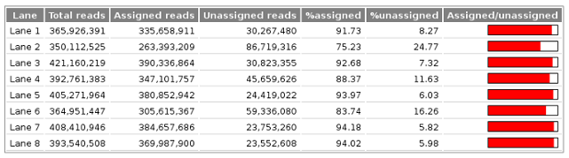

Processing QC Reports
=====================

The :doc:`auto_process make_fastqs <../using/make_fastqs>` command
outputs an HTML report summarising read counts by lane, project and
sample. The report gives a quick overview of the quality of the
demultiplexing and tries to highlight potential problems.

An example of the top of a processing QC report page is shown below:

The report comprises three sections:

* :ref:`processing_qc_per_lane_statistics`
* :ref:`processing_qc_per_lane_statistics_by_sample`
* :ref:`processing_qc_per_file_statistics_by_project`

.. _processing_qc_per_lane_statistics:

*******************
Per-lane statistics
*******************

This section gives an overview of how well demultiplexing has
worked for each lane, by listing the proportion of reads in each
lane which have been assigned to samples from the sample sheet.

An example where demultiplexing has worked well looks like:

The red barplots give a quick indication of the percentage of
reads which were assigned; typically >95% indicates very good
demultiplexing.

An example where demultiplexing has been less successful for
some lanes might look like:

In this example it is apparent that much lower percentages of reads
in lanes 2 and 6 have been assigned to samples compared with the
other lanes.

In extreme cases where the assigned percentages are very low these
plots might indicate that there is a problem with the barcode
sequences used in demultiplexing; the
:doc:`analyse_barcodes <../using/analyse_barcodes>` command can be
used to investigate this in more depth.

.. _processing_qc_per_lane_statistics_by_sample:

*****************************
Per-lane statistics by sample
*****************************

This section lists the number of reads assigned to each sample
within each lane, with an indication of the proportion those
reads are of the total number of reads in the lane. This can
highlight samples with a disportionately low or high number of
reads compared to others in the same lane.

An example where reads are evenly distributed across all
samples might look like:

This can be contrasted with an example where some samples have
very low read counts compared to others:

	   
.. _processing_qc_per_file_statistics_by_project:

******************************
Per-file statistics by project
******************************

This section gives detailed statistics for each project in the
run, broken down by Fastq file.

For example:

For each Fastq the table lists:

* File size
* Number of reads from each lane that the sample was run in
* Barplot indicating the proportion of reads from each lane
* Total number of reads in the Fastq file

