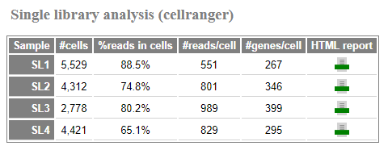
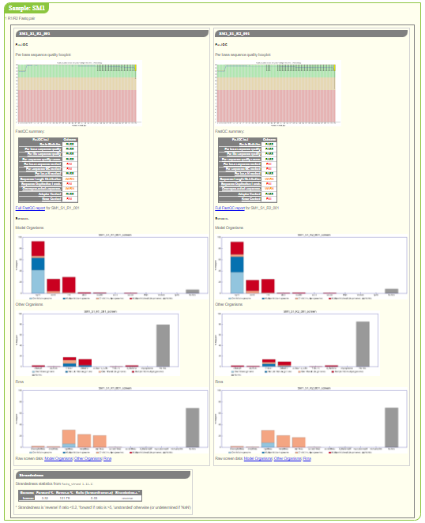

QC Reports
==========

The :doc:`auto_process run_qc <../using/run_qc>` command outputs an
HTML report for the QC for each of the projects in the analysis
directory, which enables an assessment of the quality of the Fastq
files for each sample in the project and tries to highlight aspects
which might pose problems with the data in subsequent analyses.

An example of the top of a QC report index page is shown below:

.. image:: ../images/qc/qc_report_full.png
   :align: center

The report consists of:

* :ref:`qc_report_project_metadata`
* :ref:`qc_report_qc_summary_table`
* :ref:`qc_report_qc_outputs_per_fastq`

.. _qc_report_project_metadata:

************************
Project metadata summary
************************

The project metadata table summarises information associated with the
project, including the user, PI, library type, organisms and QC
protocol.

.. _qc_report_qc_summary_table:

****************
QC summary table
****************

The QC summary table summarises the key QC results for each sample
and Fastq or Fastq pair (for paired end data).

For example:

.. image:: ../images/qc/qc_report_summary.png
   :align: center

The summary includes the following metrics for example sample
and Fastq:

* Number of reads or read pairs
* Mean and range of sequence lengths
* :ref:`qc_report_quality_boxplots`
* :ref:`qc_report_fastqc_summary_plots`
* :ref:`qc_report_fastq_screen_summary_plots`
* :ref:`qc_report_strandedness`
* :ref:`qc_report_read_counts`
* :ref:`qc_report_sequence_length_dist_plots`
* :ref:`qc_report_sequence_deduplication_plots`
* :ref:`qc_report_adapter_summary_plots`

One purpose of this table is to help pick up on trends and identify
any outliers within the dataset as a whole; hence the main function
of these plots are to convey a general sense of the data.

Note that not all outputs might appear, depending on the
:doc:`QC protocol <../using/run_qc>` that was used.

The sample and Fastq names in the table link through to the
full QC outputs for the sample or Fastqs in question; other items
(e.g. the quality boxplots) link to the relevant parts of the full
QC outputs section (see :ref:`qc_report_qc_outputs_per_fastq`).

An additional summary table may appear after this one with details
of outputs from 10xGenomics single library analyses (see
:ref:`qc_report_single_library_analyses`).

.. note::

   In earlier versions of the QC reports, links to single library
   analyses were appended directly to the main summary table, and
   no separate sigle library analyses table was present.

.. _qc_report_quality_boxplots:

Quality boxplots
----------------

The summary table includes a small version of the sequence quality
boxplot from ``fastqc``, for example:

.. image:: ../images/qc/uboxplot.png
   :align: center

A larger version of the plot is presented in the
:ref:`qc_report_qc_outputs_per_fastq` section.

.. _qc_report_fastqc_summary_plots:

Fastqc summary plots
--------------------

The output from ``fastqc`` includes a summary table with a set of
metrics and an indication of whether the Fastq has passed, failed
or triggered a warning for each.

The summary table includes a small plot which gives an impression of
the overall state of the metrics for each Fastq file, for example:

.. image:: ../images/qc/fastqc_uplot.png
   :align: center

Each bar in the plot represents one of the ``fastqc`` metrics,
(for example "Basic statistics", "Per base sequence quality", and
so on); the colour (red, amber, green) and position (left, centre,
right) indicate the status of the metric as determined by
``fastqc``.

The data are presented in more detail in a table in the
:ref:`qc_report_qc_outputs_per_fastq` section.

.. _qc_report_fastq_screen_summary_plots:

Fastq_screen summary plots
--------------------------

The summary table includes a small plot which represents the
outputs from ``fastq_screen``, for example:

.. image:: ../images/qc/fastq_screen_uplot.png
   :align: center

The three boxes represent (from left to right) the model organisms,
other organisms and rRNA plots produced by ``fastq_screen``. The
full plots and links to the raw data for each screen can be found
in the :ref:`qc_report_qc_outputs_per_fastq` section.

.. _qc_report_strandedness:

Strandedness
------------

``fastq_strand.py`` runs ``STAR`` to get the number of reads which
map to the forward and reverse strands; it then calculates a
pseudo-percentage ("pseudo" because it can exceed 100%) for foward
and reverse.

The summary table reports the pseudo-percentages as a barplot with
a pair of barplots, where the top bar represents the forward
pseudo-percentage and the bottom bar the reverse value.

Some examples:

.. table:: Example strandedness plots
   :widths: auto

   ========================= =======================
   Example                   Interpretation
   ========================= =======================
   |strandedness_forward|    Likely forward stranded
   |strandedness_reverse|    Likely reverse stranded
   |strandedness_no_strand|  Likely unstranded
   ========================= =======================

More detailed information about the strandedness statistics
is given in the :ref:`qc_report_qc_outputs_per_fastq` section.

.. |strandedness_forward| image:: ../images/qc/strandedness_forward.png
.. |strandedness_reverse| image:: ../images/qc/strandedness_reverse.png
.. |strandedness_no_strand| image:: ../images/qc/strandedness_no_strand.png

.. _qc_report_read_counts:

Read count plots
----------------

The read count plots indicate the relative number of reads for each
Fastq, and the proportion of those reads which are masked and/or padded.

* The solid portion of the bar represents the number of reads in the
  Fastq file, scaled to the highest number of reads present across
  all Fastqs in the project (so the largest Fastqs will have a bar
  consisting entirely of solid colours).

* Within the solid portion of each bar, different colours represent
  the proportion of reads which are either masked (red), padded
  (orange), or neither masked or padded (green).

.. note::

   "Masked" reads have sequences which consist entirely of N's (e.g.
   ``NNNNNNNNNNNNN``), whilst "padded" reads have sequences which have
   one or more trailing N's (e.g. ``ATTAGGGCCNNNN``).

Examples:

.. table:: Example read counts plots
   :widths: auto

   ============================ ===================================
   Example                      Interpretation
   ============================ ===================================
   |read_count_uplot|           Good data: no masked or padded
                                reads present in Fastq (bar is
				green) & high number of reads
				compared to largest Fastq in
				report (solid portion occupies
				most of plot)
   |read_count_uplot_small|     Good data: no masked or padded
                                reads but small number of reads
				compared to largest Fastq in
				report (solid portion occupies
				small part of plot)
   |read_count_uplot_mask_pad1| Reasonable data: only small
                                proportions of masked (red
				portion of bar) and padded reads
				(orange portion of bar) & highest
				number of reads across all Fastqs
				in report (plot is entirely solid
				colour)
   |read_count_uplot_mask_pad2| Poor data: high proportions of
                                masked (red portion of bar) and
                                padded reads (orange portion of
				bar)
   ============================ ===================================

.. |read_count_uplot|           image:: ../images/auto/qc/read_count_uplot.png
.. |read_count_uplot_small|     image:: ../images/auto/qc/read_count_uplot_small.png
.. |read_count_uplot_mask_pad1| image:: ../images/auto/qc/read_count_uplot_masking_and_padding1.png
.. |read_count_uplot_mask_pad2| image:: ../images/auto/qc/read_count_uplot_masking_and_padding2.png

.. _qc_report_sequence_length_dist_plots:

Sequence length distribution plots
----------------------------------

The sequence length distribution plots are histograms showing the
relative number of reads with different sequence lengths. The data
is analogous to that shown in the
`Sequence Length Distribution <https://www.bioinformatics.babraham.ac.uk/projects/fastqc/Help/3%20Analysis%20Modules/7%20Sequence%20Length%20Distribution.html>`_
module of ``fastqc``.

Typically for trimmed data the plots will look like e.g.:

.. image:: ../images/auto/qc/seq_dist_uplot.png
   :align: center

An example with a range of sequence lengths from an adapter-trimmed
miRNA-seq dataset which shows peaks for shorter sequence lengths
followed by a long tail:

.. image:: ../images/auto/qc/seq_dist_uplot_slewed.png
   :align: center

For untrimmed data or other datasets where all sequences are the
same length, plots will look like e.g.

.. image:: ../images/auto/qc/seq_dist_uplot_untrimmed.png
   :align: center

.. _qc_report_sequence_deduplication_plots:

Sequence deduplication summary plots
------------------------------------

The sequence deduplication summary plots indicate the level of
sequence duplication in the data, according to the
`Sequence Duplication Levels <https://www.bioinformatics.babraham.ac.uk/projects/fastqc/Help/3%20Analysis%20Modules/8%20Duplicate%20Sequences.html>`_
module of ``fastqc``.

The deduplication level is the percentage of reads that are left
when reads with duplicated sequences (i.e. sequences that appear
in multiple reads) are removed, and is an indication of the
number of reads with distinct sequences within the data.

(See the Biostars thread
`Revisiting the FastQC read duplication report <https://www.biostars.org/p/107402/>`_ for more explanation of the deduplication in ``fastqc``.)

In the plots the solid portion of the bar represents the fraction
of reads after deduplication. The colour of the bar indicates
which category the data fall into depending on the level of reads
remaining:

* Blue indicates more than 80% of reads remain after deduplication
* Orange indicates 30-80% of reads remain
* Red indicates less than 30% reads remain

The background of the plot also uses lighter versions of these
colours to indicate the thresholds.

For example:

.. table:: Example sequence deduplication plots
   :widths: auto

   ============================ ===================================
   Example                      Interpretation
   ============================ ===================================
   |dedup_uplot_pass|           Pass: over 80% of reads remain
                                after duplicate sequences have been
			        removed
   |dedup_uplot_warn|           Warn: less than 80% of reads remain
                                after duplicate sequences have been
			        removed
   |dedup_uplot_fail|           Fail: less than 30% of reads remain
                                after duplicate sequences have been
			        removed
   |dedup_uplot_bg|             Plot background with no data (to
                                show thresholds for pass, warn and
				fail)
   ============================ ===================================

.. |dedup_uplot_pass| image:: ../images/auto/qc/deduplication_uplot_pass.png
.. |dedup_uplot_warn| image:: ../images/auto/qc/deduplication_uplot_warn.png
.. |dedup_uplot_fail| image:: ../images/auto/qc/deduplication_uplot_fail.png
.. |dedup_uplot_bg|   image:: ../images/auto/qc/deduplication_uplot_bg.png

.. _qc_report_adapter_summary_plots:

Adapter content summary plots
-----------------------------

The adapter content summary plots condense the data from the
`Adapter Sequences <https://www.bioinformatics.babraham.ac.uk/projects/fastqc/Help/3%20Analysis%20Modules/10%20Adapter%20Content.html>`_
module of ``fastqc`` into a single metric, to indicate the proportion
of adapter sequences in a Fastq file.

A single adapter fraction is obtained for each adapter class
detected by ``fastqc`` by calculating the fraction of plot area
which lies under the curves for each adapter in the "Adapter Content"
plots. This is then represented as a bar where the coloured portion
corresponds to the fraction for each adapter.

.. note::

   The colours of the bar match the colours used by ``fastqc`` for
   different adapter classes.

For example:

.. table:: Example read counts plots
   :widths: auto

   ============================ ===================================
   Example                      Interpretation
   ============================ ===================================
   |adapter_uplot_no_adptrs|    No adapter content detected (bar
                                is grey)
   |adapter_uplot_adptrs_sml|   Small amount of adapter content
	                        detected (bar is partially solid,
				with green colour indicating
				presence of Nextera Transposase
				sequences)
   |adapter_uplot_adptrs_lrg|   Significant adapter content
	                        detected (more than 50% of the bar
				is solid, with red colour
				indicating presence of Illumina
				Universal Adapter sequences)
   ============================ ===================================

.. |adapter_uplot_no_adptrs|  image:: ../images/auto/qc/adapter_uplot_no_adptrs.png
.. |adapter_uplot_adptrs_sml| image:: ../images/auto/qc/adapter_uplot_adptrs_sml.png
.. |adapter_uplot_adptrs_lrg| image:: ../images/auto/qc/adapter_uplot_adptrs_lrg.png

.. _qc_report_single_library_analyses:

Single library analyses
-----------------------

For 10xGenomics datasets single library analyses may also have
been performed for each sample using the ``count`` command of the
appropriate 10xGenomics pipeline (e.g. ``cellranger`` for scRNA-seq
data, ``cellranger-atac`` for scATAC-seq data etc).

In these cases an additional summary table will appear in the report
with appropriate metrics for each sample along with links to the HTML
reports from the ``count`` command. For example, for an scRNA-seq
dataset:

The reported metrics will depend on the pipeline and type of data.

Details of the contents of the linked ``web_summary.html`` report can
be found in the appropriate documentation for the 10xGenomics pipeline:

 * ``cellranger``: https://support.10xgenomics.com/single-cell-gene-expression/software/pipelines/latest/output/summary
 * ``cellranger-atac``: https://support.10xgenomics.com/single-cell-atac/software/pipelines/latest/output/summary
 * ``cellranger-arc``: https://support.10xgenomics.com/single-cell-multiome-atac-gex/software/pipelines/latest/output/summary

.. note::

   The full set of outputs can be found under the ``cellranger_count``
   subdirectory of the project directory, when single library
   analysis has been performed.
   
.. _qc_report_qc_outputs_per_fastq:

*************************
Full QC outputs per Fastq
*************************

After the summary table, the full QC outputs for each Fastq or
Fastq pair are grouped by sample, for example:

For each Fastq the subsections consist of:

* ``fastqc`` outputs including the sequence quality boxplot
  and a table of the quality metrics with links to the full
  report:

  .. image:: ../images/qc/fastqc_full.png

* ``fastq_screen`` outputs for each screen, for example:

  .. image:: ../images/qc/fastq_screen_full.png

* ``fastq_strand`` data:
  
  .. image:: ../images/qc/strandedness_full.png
