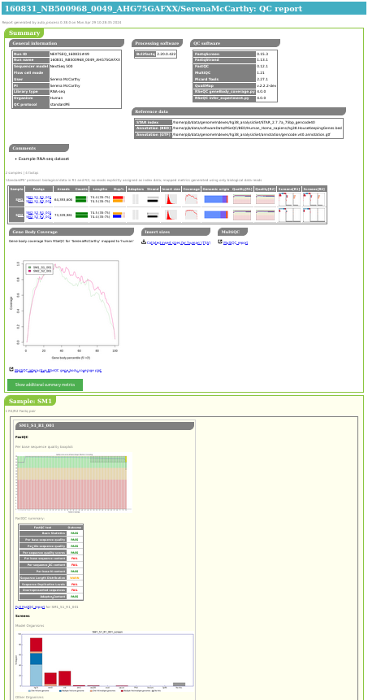
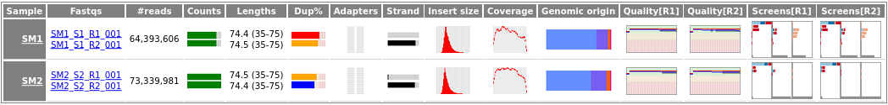
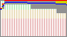

QC Reports
==========

The :doc:`auto_process run_qc <../using/run_qc>` command outputs an
HTML report for the QC for each of the projects in the analysis
directory. 

An example of the top of a QC report index page is shown below:

The first part consists of two tables: the first summarises any metadata
associated with the project, and the second attempts to summarise the
key QC results for each Fastq, each Fastq pair (for paired end data),
and each sample.

For example:

The purpose of this table is to help pick up on trends and identify any
outliers within the dataset as a whole; hence it uses small plots to
convey a general sense of the data.

Quality boxplots
----------------

The summary table includes a small version of the sequence quality
boxplot from ``fastqc``, for example:

Fastqc summary plots
--------------------

The output from ``fastqc`` includes a summary table with a set of
metrics and an indication of whether the Fastq has passed, failed
or triggered a warning for each.

The summary table includes a small plot which gives an impression of
the overall state of the metrics for each Fastq file, for example:

Fastq_screen summary plots
--------------------------

The summary table includes a small plot which summarises the
outputs from ``fastq_screen``, for example:

Strandedness
------------

``fastq_strand.py`` runs ``STAR`` to get the number of reads which
map to the forward and reverse strands; it then calculates a
pseudo-percentage ("pseudo" because it can exceed 100%) for foward
and reverse.

The summary table reports the pseudo-percentages as a barplot with
a pair of barplots, where the top bar represents the forward
pseudo-percentage and the bottom bar the reverse value.

Some examples:

Likely forward strand:

Likely reverse strand:

Likely unstranded:

